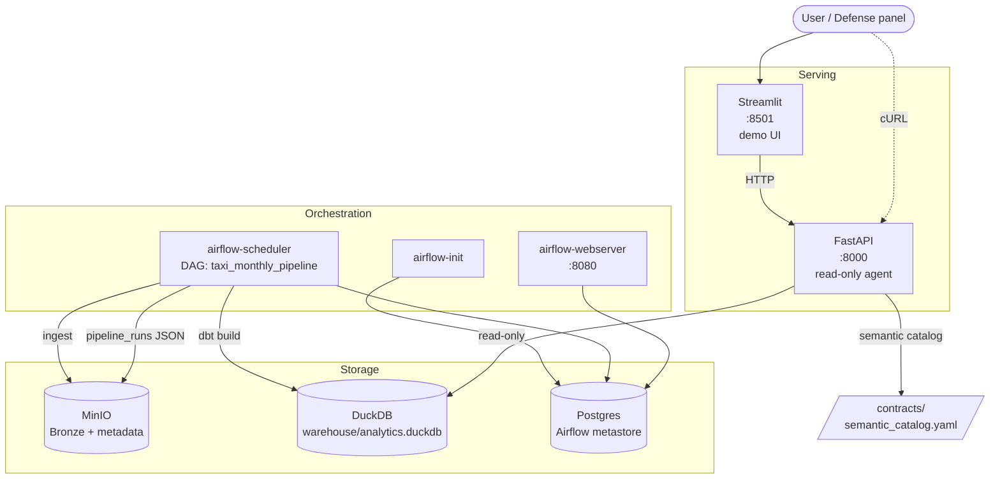
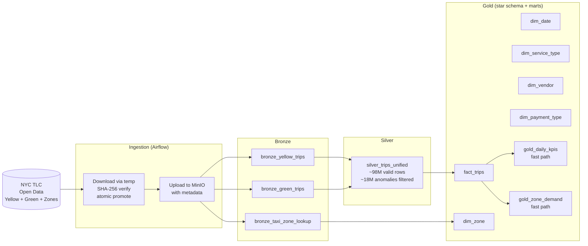
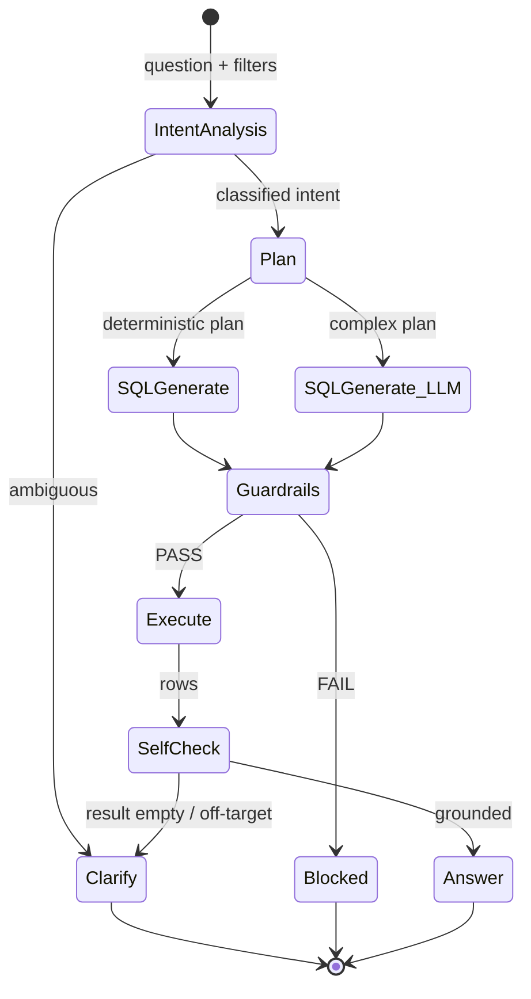
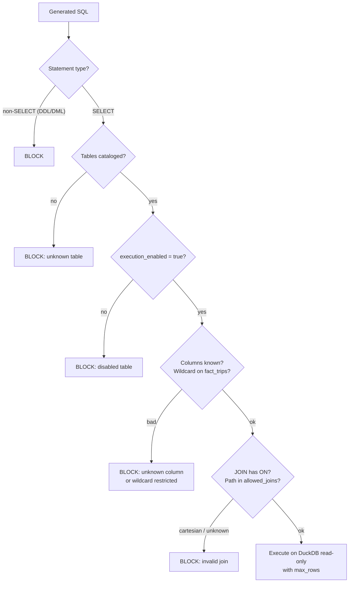
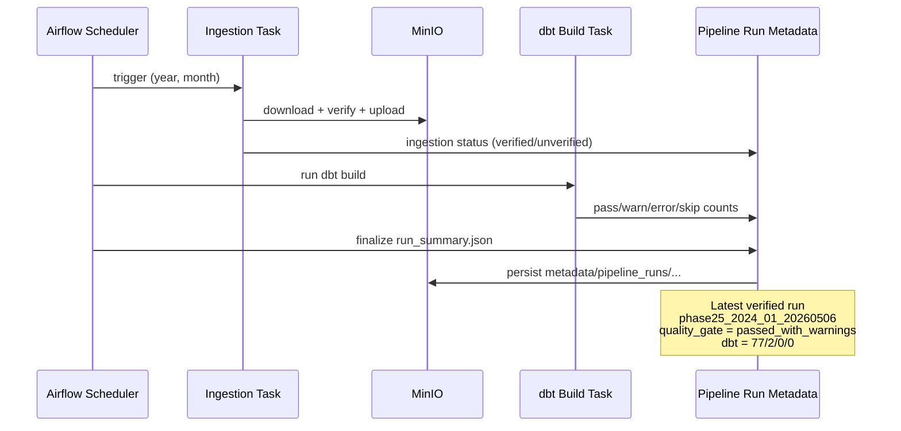
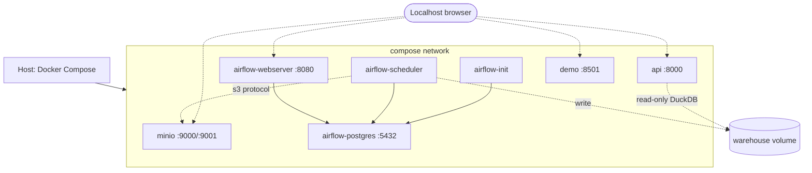

# Architecture Diagrams

Visual companion to [architecture.md](../architecture.md). All diagrams use
[Mermaid](https://mermaid.js.org/) and render natively on GitHub. Use these as
figures in the thesis report.

- Defense window: `2024-01-01` through `2024-06-30`.
- Stack: Docker Compose with MinIO, Airflow, dbt, DuckDB, FastAPI, Streamlit.

---

## Figure 1. System Component Diagram

Logical view of the seven Docker services and their dependencies.



---

## Figure 2. Bronze → Silver → Gold Data Flow

Layered transformation from raw TLC files to the agent-visible Gold surface.



**Notes:**
- Bronze stores raw files with minimal mutation.
- Silver applies validity filters: pickup date inside partition month,
  dropoff > pickup, amount > 0, distance plausible.
- Gold is the only surface exposed to the agent.

---

## Figure 3. Read-Only Agent State Machine

Workflow of `services/api/app/agent.py` from user question to answer.



**Key properties:**
- Guardrails are mandatory; no execution without PASS.
- Deterministic answer is default; OpenAI synthesis is opt-in and must be
  grounded in executed rows only.
- `agent_steps` are returned in every response for traceability.

---

## Figure 4. SQL Guardrails Pipeline

Layered validation of every generated SQL before execution.



Verified against 11 unsafe cases in
[agent-evaluation-results.json](../agent-evaluation-results.json) — all blocked
(unsafe_rejection_rate = 1.0).

---

## Figure 5. Pipeline Run Metadata Lifecycle

Phase 25 durable observability for every Airflow DAG run.



---

## Figure 6. Semantic Catalog as Contract

`contracts/semantic_catalog.yaml` is the single source of truth for what the
agent can see.

```mermaid
flowchart LR
    YAML[semantic_catalog.yaml]
    YAML --> SCHEMA[/api/v1/schema endpoint]
    YAML --> COL_G[Column guardrails]
    YAML --> JOIN_G[Join guardrails]
    YAML --> EXEC_G[execution_enabled gate]
    YAML --> PLANNER[Deterministic planner]
    YAML --> PROMPT[LLM SQL prompt context]

    COL_G --> CHECK[/SQL guardrails/]
    JOIN_G --> CHECK
    EXEC_G --> CHECK
    PLANNER --> CHECK
    CHECK --> DUCK[(DuckDB execute)]
```

The catalog covers 8 execution-enabled Gold objects:
- 2 aggregate marts: `gold_daily_kpis`, `gold_zone_demand`
- 1 fact: `fact_trips`
- 5 dimensions: `dim_date`, `dim_zone`, `dim_service_type`, `dim_vendor`,
  `dim_payment_type`

---

## Figure 7. Deployment Topology (Docker)



---

## How to render in the thesis report

1. **For Word/Google Docs**: use [mermaid.live](https://mermaid.live) — paste
   each block, export PNG/SVG, embed as figure.
2. **For LaTeX**: convert SVG via `mermaid-cli` (`mmdc -i diagram.mmd -o
   diagram.pdf`).
3. **For PDF preview in IDE**: install the Markdown Preview Mermaid Support
   extension (VS Code).

Each figure should appear in the report with caption (`Hình 3.1`, `Hình 3.2`...)
matching the section in [thesis-outline.md](thesis-outline.md) Ch.3.
